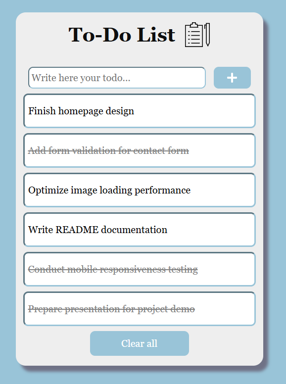
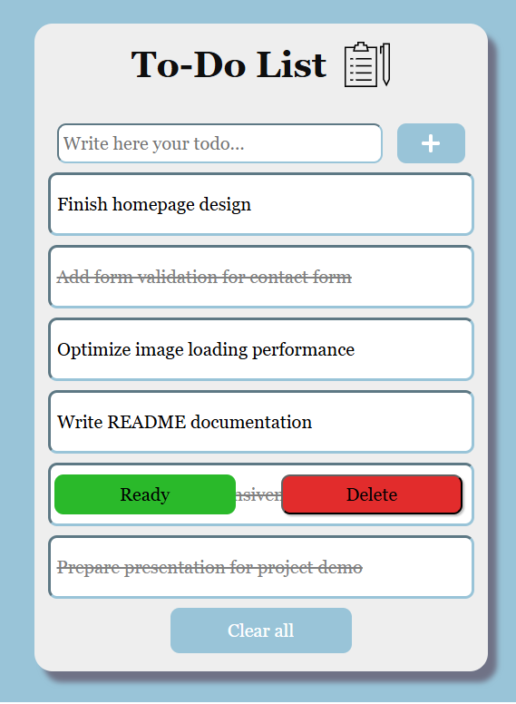
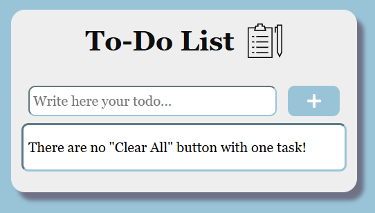

# Приложение "To-Do List" (Список дел)

Простой и удобный список задач с интуитивно понятным интерфейсом.  
Позволяет добавлять, отмечать как выполненные, удалять и очищать список задач.

---

## 🔧 Основные функции

- **Добавление задач**: Введите текст в поле ввода и нажмите кнопку "+".
- **Отметка как выполнено**: Нажмите кнопку "Ready", чтобы отметить задачу как выполненную.
- **Удаление задачи**: Используйте кнопку "Delete", чтобы удалить отдельную задачу.
- **Очистка списка**: Кнопка "Clear all" удаляет все задачи сразу.  
  *(Неактивна, если осталась одна задача)*

---

## 💻 Использованные технологии

- **React** — для построения пользовательского интерфейса
- **Vite** — для сборки проекта и запуска локального сервера
- **JavaScript (JSX)** — для логики и взаимодействия компонентов
- **HTML5** — для структуры страницы
- **CSS3** — для стилизации интерфейса

---

## 🚀 Установка и запуск

1. Склонировать репозиторий:

    ```
    git clone https://github.com/Rozerik/To-Do-List
    cd To-Do-List
    ```
2. Установить зависимости:

    ```
    npm install
    ```
3. Запустить локальный сервер:

    ```
    npm run dev
    ```
## 🖼 Скриншоты приложения

    Исходное состояние приложения:
    

    Добавленные задачи:
    

    Отметка задачи как выполненной или ее удаление:
    

    Кнопка "Clear All" неактивна, если осталась одна задача:
    

## 🛠 Как использовать

1. Добавить задачу:
    - Ввести текст в поле ввода
    - Нажать кнопку "+"
2. Отметить как выполнено:
    - Навести курсор на нужную задачу
    - Нажать кнопку "Ready", которая появилась поверх задачи
    - Текст задачи будет зачеркнут
3. Удалить задачу:
    - Навести курсор на нужную задачу
    - Нажать кнопку "Delete"
    - Задача будет удалена из списка
4. Очистить весь список:
    - Нажать кнопку "Clear All", чтобы удалить все задачи

## 📌 Автор
Илья Атрохин
GitHub: https://github.com/Rozerik


